# Práctica de laboratorio 4: Traducción dirigida por la sintaxis
Está práctica tiene como objetivo analizar una calculadora aritmética que utiliza **Jison**, un generador de analizadores sintácticos para **JavaScript**. Esta sigue una **definición dirigida por la sintaxis** que permite no solo reconocer expresiones matemáticas, sino que también calcular su valor en tiempo real durante el análisis. Analizaremos su comportamiento y haremos algunas modificaciones

Esta práctica forma parte de la asignatura **Procesadores de Lenguajes**, una de las [asignaturas obligatorias del itinerario de Computación](https://drive.google.com/file/d/12ELpn-UL12sExDYd6yw_X6WwZVcq4q4G/view).

## Estructura del informe
Las tareas que debemos realizar para configurar el entorno serán:

1. **Práctica de laboratorio 4: Traducción dirigida por la sintaxis**
   1. Instalar dependencias y ejecutar los test.
   2. Cuestiones sobre el Lexer en Jison.
   3. Modificar el analizador léxico de grammar.jison para que se salte los comentarios de una línea que empiezan por //.
   4. Modificar el analizador léxico de grammar.jison para que reconozca números en punto flotante.
   5. Añadir pruebas para las modificaciones del analizador léxico de grammar.jison.
2. **Práctica de laboratorio 5: Traducción dirigida por la sintaxis: gramática**
   1. Partiendo de la gramática y las siguientes frases 4.0-2.0\*3.0, 2\**3**2 y 7-4/2: 
      1. Escribir la derivación para cada una de las frases.
      2. Escribir el árbol de análisis sintáctico (parse tree) para cada una de las frases.
      3. ¿En qué orden se evaluan las acciones semánticas para cada una de las frases?
      4. Añadir un fichero prec.test.js al directorio \__test__ con las siguientes pruebas y compruebe que con la implementación actual fallan.
   2. Modificar la gramática para que respete la lógica matemática.
   3. Añadir pruebas para las modificaciones hechas.
   4. Modificar el programa para que se reconozcan expresiones entre paréntesis.
   5. Añadir pruebas para las expresiones de paréntesis.

---

### 1. Instalar dependencias y ejecutar los test
El repositorio ya incluía una base con la gramática, el lexer y las funciones de cálculo. Los pasos realizados fueron:

- Instalación: Se ejecutó `npm install` para obtener las dependencias necesarias, como Jison y Jest.
- Compilación: Se generó el analizador sintáctico ejecutable con el comando `npx jison src/grammar.jison -o src/parser.js`.
- Test: Se ejecutó `npm test` para comprobar que todo funcionaba correctamente.

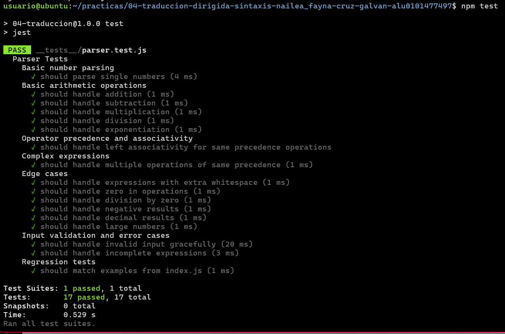

### 2. Cuestiones sobre el Lexer en Jison

1. **Describa la diferencia entre /\* skip whitespace \*/ y devolver un token.**

Cuando usamos `/* skip whitespace */` lo que sucede es que el analizador lo ignora y pasa al siguiente carácter, como si no hubiera habido nada en el fichero. Sin embargo, cuando usamos `return` el lexer lo identifica (ya sea número u operador) y se lo pasa al analizador sintáctico.

2. **Escriba la secuencia exacta de tokens producidos para la entrada 123\*\*45+@.**

123 → NUMBER

\** → OP

45 → NUMBER

\+ → OP

@ → INVALID

al terminar la entrada → EOF

3. **Indique por qué ** debe aparecer antes que [-+*/].**

Porque el lexer aplica las reglas en orden. Es decir, si tenemos la regla de [-+*/] antes que **, no llegaría a ** sino que se quedaría con * y luego el segundo * como otro OP diferente. Lo que queremos es que ** se reconozca como un solo operador para evitar errores. Siempre que una regla pueda coincidir al inicio con otra, debemos escribir la más larga arriba.

Esto también puede coincidir con *else* y *elseif*, que siguiendo esta lógica, *elseif* tendría que ir el primero.

4. **Explique cuándo se devuelve EOF.**

EOF se devuelve cuando se llega al final del fichero y no no quedan más caracteres por leer. Es una forma de indicarle al parser que el análisis ha terminado.

5. **Explique por qué existe la regla . que devuelve INVALID.**

La regla *.* se aplicará a cualquier carácter que no haya sido reconocido por las reglas anteriores. Nos va a servir para identificar errores, como devolvemos el token *INVALID* podremos gestionar dicho error como queramos. De esta manera el programa no se rompe de golpe sino que podemos decir, por ejemplo, `Expecting 'NUMBER', got 'INVALID'`.

### 3. Modificar el analizador léxico de grammar.jison para que se salte los comentarios de una línea que empiezan por //.

Para lograr que el analizador ignore los comentarios, he añadido una nueva regla al bloque %lex en el archivo `grammar.jison`:

`"//".*           { /* skip comments */ }`

Gracias a esta regla, cualquier texto que empiece por //, seguido de cualquier carácter (.*), será ignorado.

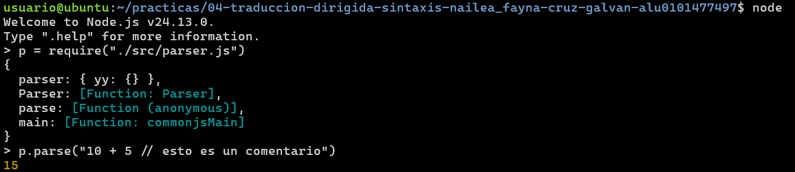

### 4. Modificar el analizador léxico de grammar.jison para que reconozca números en punto flotante.

Lo que hice en este caso fue modificar la regla original que decía que los números seguían la regla [0-9]+. Esta es la nueva expresión regular:

`[0-9]+(\.[0-9]+)?([eE][-+]?[0-9]+)?      { return 'NUMBER'; }`

Con esta nueva expresión, el token NUMBER puede reconocer números **enteros**, u opcionalmente tener **parte decimal**, con **notación científica**, o **ambas**. Para la notación científica acepta tanto negativos como positivos, y *e* mayúscula y minúscula.

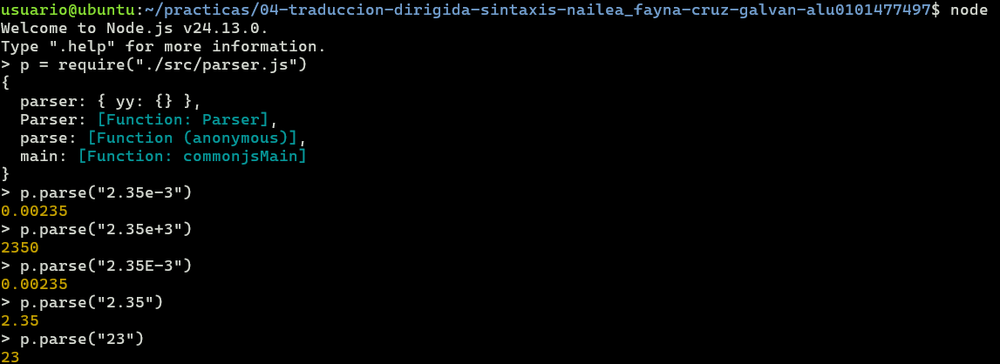

### 5. Añadir pruebas para las modificaciones del analizador léxico de grammar.jison.

Para verificar que las modificaciones funcionan correctamente, he añadido nuevas pruebas al fichero `parser.test.js`. Además de comprobar que se procesan correctamente (ignorando los comentarios y tomando los flotantes como números), se hacen operaciones con números float.

Estos son las pruebas añadidas:

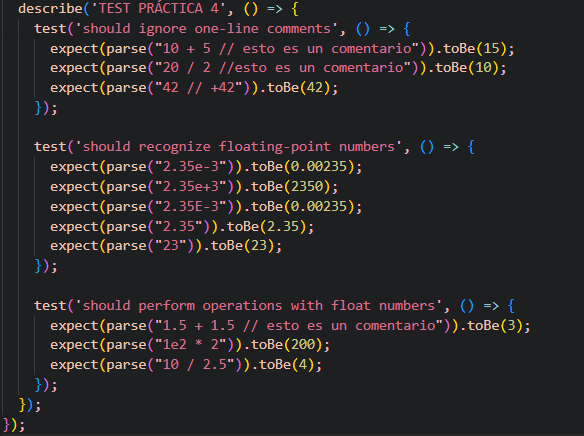

Y vemos que se ejecutan correctamente:

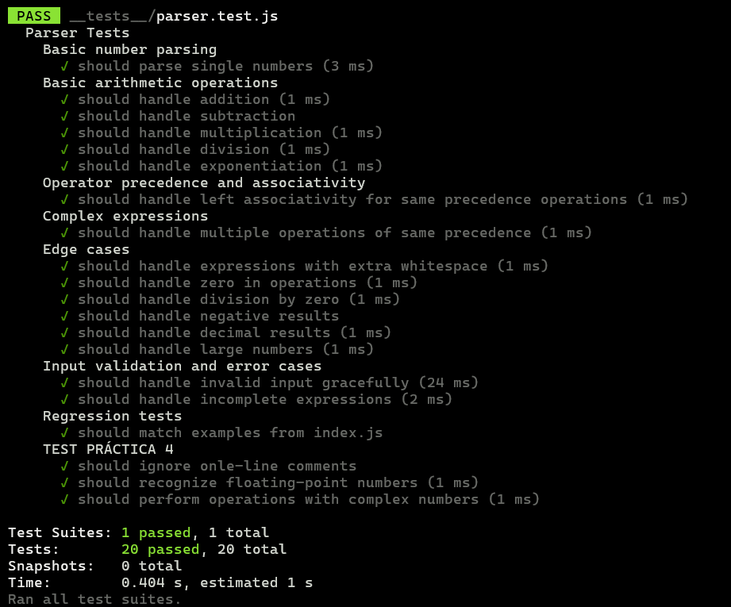

# Práctica de laboratorio 5: Traducción dirigida por la sintaxis: gramática
Para esta práctica se nos pide **actualizar la gramática** de manera que se respete la precedencia y la asociatividad de los operadores matemáticos, incluyendo los paréntesis.

### 1. Partiendo de la gramática y las siguientes frases 4.0-2.0\*3.0, 2\**3**2 y 7-4/2.

Tanto las derivaciones como los árboles de análisis sintácticos se encuentran en el [siguiente documento](derivations-and-parse-trees.pdf).
### 1.1. Escribir la derivación para cada una de las frases.
- 4.0-2.0\*3.0

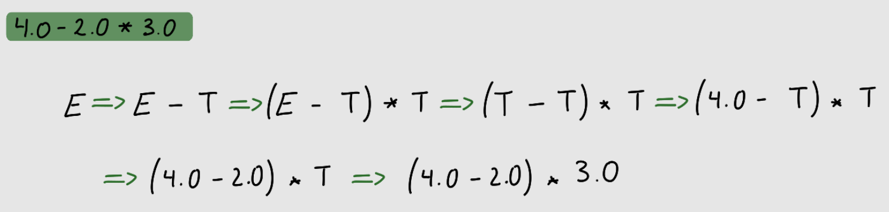

- 2\**3**2

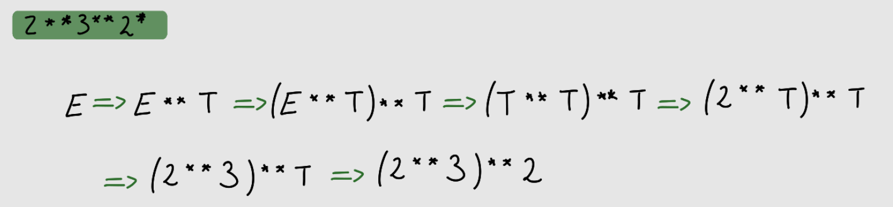

- 7-4/2

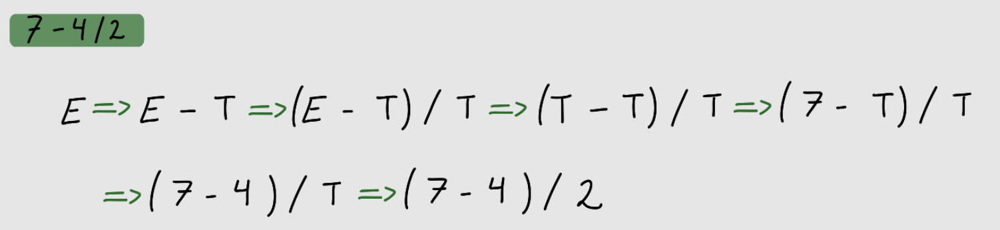

### 1.2. Escribir el árbol de análisis sintáctico (parse tree) para cada una de las frases.
- 4.0-2.0\*3.0

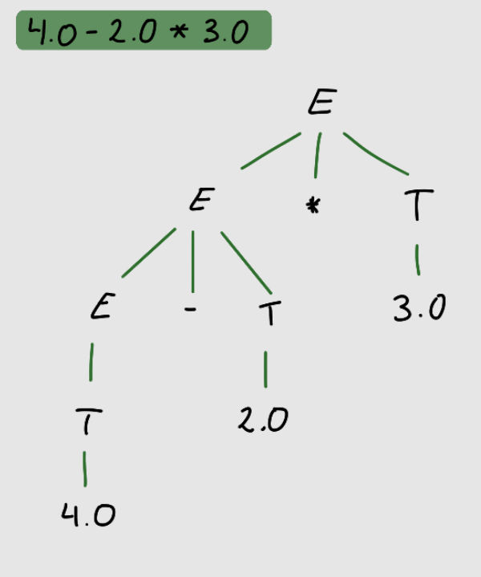

- 2\**3**2

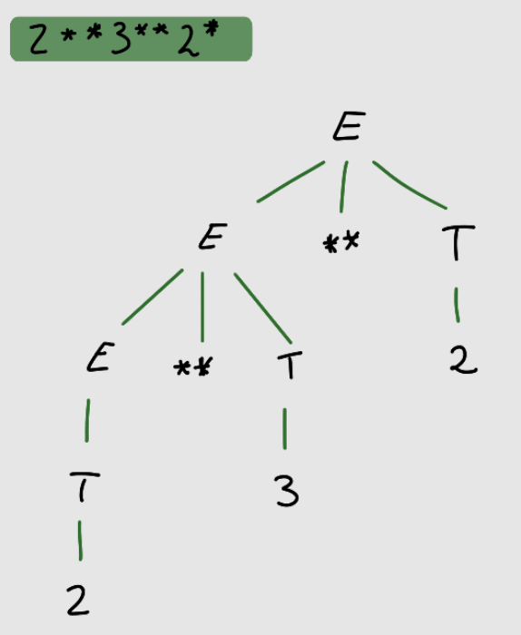

- 7-4/2

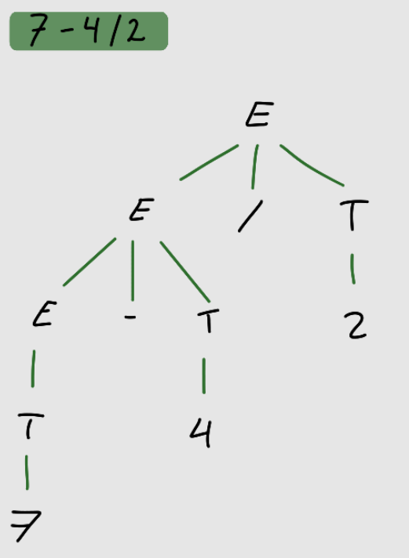

### 1.3. ¿En qué orden se evaluan las acciones semánticas para cada una de las frases?
El orden de evaluación en la gramática actual es de **izquierda a derecha** debido a su estructura recursiva por la izquierda y a que todos los operadores comparten el mismo nivel jerárquico bajo el token **OP**. Como no se han definido distintos niveles de precedencia para separar, por ejemplo, sumas de multiplicaciones, el parser simplemente aplica las acciones semánticas (operate) según van apareciendo los operadores en la frase. Esto provoca que se ignoren las reglas matemáticas estándar, evaluando siempre primero la operación que se encuentra más a la izquierda del árbol de análisis sintáctico.

### 1.4. Añadir un fichero prec.test.js al directorio \__test__ con las siguientes pruebas y compruebe que con la implementación actual fallan.
Tras añadir el fichero, vemos que efectivamente todas las pruebas fallan con la implementación actual:

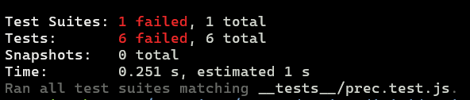

### 2. Modificar la gramática para que respete la lógica matemática.
Como habíamos visto, el error era que todos los operadores compartían el mismo nivel. Para respetar la precedencia y la asociatividad, se ha reestructurado `grammar.jison` dividiendo la evaluación siguiendo las producciones que están en el guión de la práctica. Vamos a eliminar el token genérico **OP** para simplemente utilizar los operadores literales y poder distinguirlo más facilmente.

- **E** (Sumas y restas): Tienen la menor prioridad. Usamos recursividad por la izquierda (E '+' T) ya que estos operadores son asociativos por la izquierda.
- **T** (Multiplicación y división): Al anidarse dentro de E, el parser las resuelve antes. También son asociativas por la izquierda.
- **R** (Potencias): Tienen la máxima precedencia matemática. Para lograr la asociatividad por la derecha, ubicamos la recursión a la derecha del operador (F '**' R).
- **F** (Números): La regla base que procesa los valores reales.

Una vez hemos hecho este cambio, podemos ver como ahora sí que pasan las pruebas:

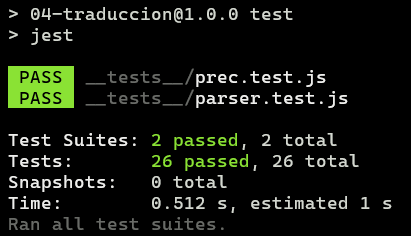

### 3. Añadir pruebas para las modificaciones hechas.
Estas son las pruebas que se han añadido para comprobar que la precedencia y asociatividad funcionan con los números flotantes:

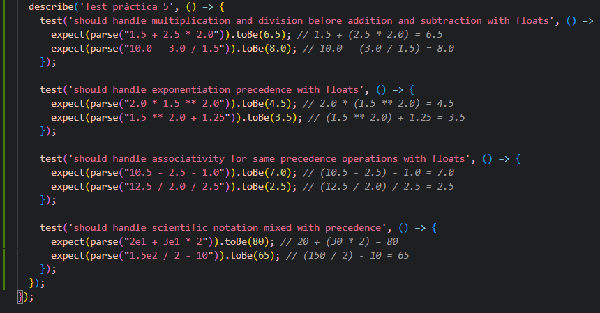

Que han sido añadidas al final del fichero `prec.test.js`, y como vemos aquí las pruebas pasan:

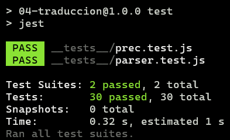

### 4. Modificar el programa para que se reconozcan expresiones entre paréntesis.
Para reconocer paréntesis, la implementación fue más sencilla porque partimos de una buena base del punto 3. Se modificaron solo dos detalles para aceptar los nuevos tokens ( y ):

- Añadimos los paréntesis a la expresión regular de los operadores **([-+*/()])**.
- Añadimos la producción F -> '(' E ')' a la regla F. Tal y como se se indica en el guión, se devuelve el valor de E para que el parser evalue lo que hay dentro primero. 

### 5. Añadir pruebas para las expresiones de paréntesis.

Estas son las pruebas que se han añadido al final del fichero `prec.test.js` para comprobar que los paréntesis funcionan correctamente:

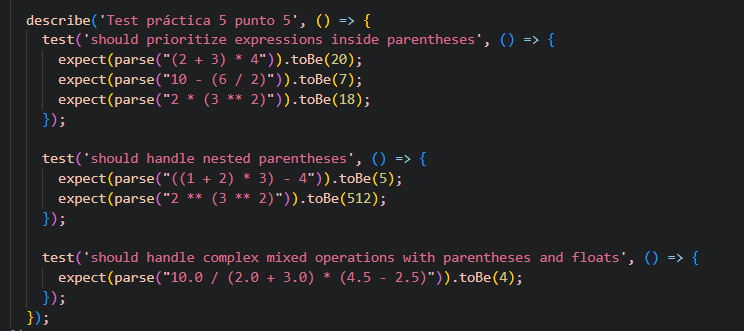

Y pasan correctamente:

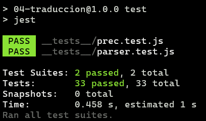